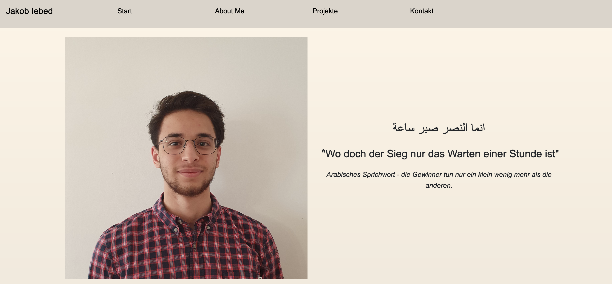

# Jakob Iebed Portfolio

### I made a Personal Portfolio usind HTML and CSS.

### Link to the website: [Jakob Iebed Portfolio](https://jakobiebed.github.io/)

### Technologies used:

- HTML
- CSS
- Bootstrap
- Github Copilot (GC) - also for this Readme.md

### Quick Facts:

- I used GC for the first time and it was a good learning experience on how not to rely on AI.
- Bootstrap is a great tool to make a website responsive.
- I learned a lot about positioning elements
- Currently the website is only in German, but of course it is possible to translate it into English.
- It is very frustrating if you don't know what you are doing, but it is very rewarding if you finally understand it.

## Features:

### Navigation Bar

In my Navbar I mostly used Bootstrap classes, I did get some from GC but I had to modify them heavily to fit my needs. After tinkering I decided to read the Bootstrap documentation and found the classes I really needed, as GC tends to overcomplicate.

### Picture and Quote

I wanted to make a good first expression. So I inserted a picture of myself and a interesting quote that I once heard. This give the persona a sympathic and fascinating touch. I took me a while to position the right picture and quote, but it was worth it.

### About Me

I wanted to give a short introduction about myself. I used a Bootstrap card to make it more interesting. I also used a Bootstrap grid to make it responsive. I used GC to generate the card, then I deleted the classes and their related "div" tags like "row" and "col-md-6" because they were unnecessary.

### Projects

For Projects I relied more on GC, as I had no idea how to make a card with a picture and a description. I used GC to generate the card and then I modified it to fit my needs.

### Contact

Last but not least I wanted to give the user the possibility to contact me. I think it is the best part of it. As it was the first part I really understood what GC is doing and how to poke around with bootstrap.

## Github

### Repository

It is my first time to practically use Repositories. It was a nightmare at the beginning, as I accidently created a git repo in my user folder for the entire PC!!!!! Thus 1000 commit requests were open.

#### way better:

I solved it by using a command (git rm -r \* I think) , but this of course also deleted my repo I was using. VS Code didn't register I deleted it. So after HOURS of trying to fix it, I found out I have to delete the entire folder and started the repository over again. Fortunately no files got hurt as they magically never took harm in my PC.

### Github Pages

I used Github Pages to deploy my website. It was very easy to use and I am very happy with the result. I like the idea of having a website that is free and easy to use.

### Copilot

Surely great, but not as good as Chatgpt and not worth 10 Dollars a month. It does not autocomplete so greatly in coding but is quite good for Readmes :). I am currently running the free month trial and I hopefully will cancel it in the right time after finishing the final project.

#### I mean the logo is really pretty.

## Youtube

Is pretty bad. The videos are not good structured, the documentation is way better. The video quality is low, maybe I should start a nice channel, as a lot of people are searching for good tutorials, the views are always pretty high for the bad content.

## Mistakes

- I should have read the documentation of Bootstrap earlier.
- I shouldn't rely on GC too much.
- Start slow and don't rush it. Develop steadily.
- REPOS are DANGEROUS, be careful with them.

&nbsp;

## Possible Improvements (with recommendations from GC)

- I could add a dark mode. People are crazy about it.
- I could add a language switcher. I could use a library for it.
- I could add a blog. I could use a CMS for it.
- I could add a contact form. I should insert javascript, but I am a bit scared :\*).
- I could add a CV. I already have done such a thing in my website for a problem set.
- I could add a link to my Github. LinkedIn is already there.

# This was Final Project

